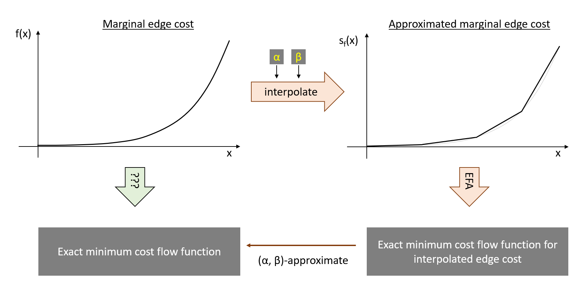

.. _mca:

================================
MCA: Marginal Cost Approximation
================================
.. currentmodule:: paminco.algo.mca

Class Description
=================
.. autoclass:: MCA
   

Main Idea
=========
Instead of computing a solution to the actual problem - i.e., a parametric mincost flow w.r.t. to
the demand factor - the MCA algorithm uses marginal cost :math:`s_f(x)` that are a piecewise 
linear interpolation of the original marginal costs :math:`f_e(x)`. This problem can then be solved
exactly with the :ref:`EFA <efa>` algorithm. This main idea is shown in the following 
image, where we follow the orange arrows to calculate a :math:`(\alpha, \beta)`-approximate minimum 
cost flow.

Settings and Interpolation
==========================
.. autosummary::
   .. :template: autoclass.rst
   :template: class_shortname.rst
   :toctree: generated/
   
   MCAConfig
   MCAInterpolationRule

Attributes
==========
.. autosummary::
   :template: base_short.rst
   :toctree: generated/

   MCA.network
   MCA.name
   MCA.config
   MCA.i
   MCA.lambda_min
   MCA.lambda_max
   MCA.breakflag
   MCA.region
   MCA.edges
   MCA.edge_coeffs
   MCA.node_potentials
   MCA.param_solution
   MCA.L0
   MCA.region_zero

Methods
=======
.. autosummary::
   :template: base_short.rst
   :toctree: generated/

   MCA.run
